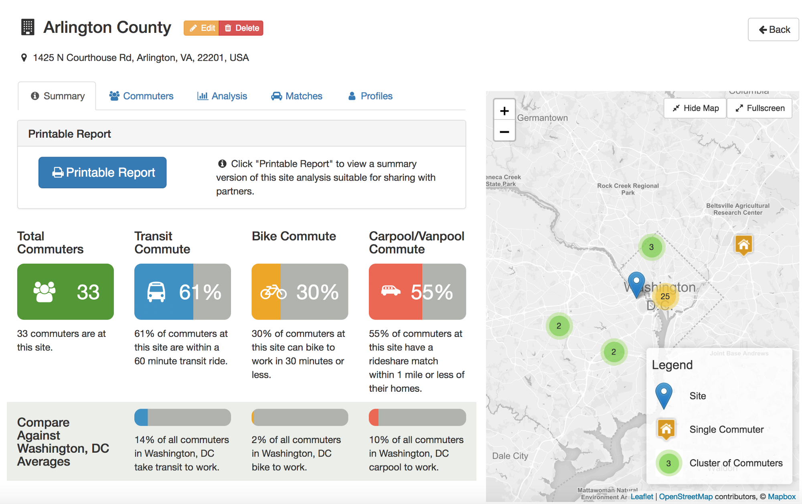

# commute

[![NPM version][npm-image]][npm-url]
[![Build status][travis-image]][travis-url]

[npm-image]: https://img.shields.io/npm/v/@conveyal/commute.svg?maxAge=2592000&style=flat-square
[npm-url]: https://www.npmjs.com/package/@conveyal/commute
[travis-image]: https://img.shields.io/travis/conveyal/commute.svg?style=flat-square
[travis-url]: https://travis-ci.org/conveyal/commute

A website for analyzing commuting patterns and more.

Check out our [blog post](https://blog.conveyal.com/conveyal-commute-identifying-mode-shift-opportunities-2f8666a3ee90) for more details!

## Installation

Commute requires the following to run:

* node.js version 6
* The [yarn](https://yarnpkg.com/en/) package manager
* A mongodb database
* API Keys for the [ESRI geocoder](https://developers.arcgis.com/features/geocoding/)
* Version v2.4.1-9-g3be6daa of [r5](https://github.com/conveyal/r5/)
* An [auth0](https://auth0.com/) tenant.

You'll need to copy `configurations/default/env.yml.tmp` to `configurations/default/env.yml` and update all of the fields that have a value of CHANGE_ME.  

To start the server, run the command:

`yarn && yarn start`

If you need additional support, please [contact us](https://www.conveyal.com/hire-us/) to discuss how Conveyal can help your company.

## Usage Documentation

View the latest documentation [here](http://commute.readthedocs.io/en/latest/).  Unfortunately, those docs are slightly out of date.
